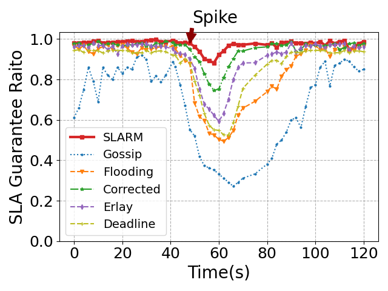
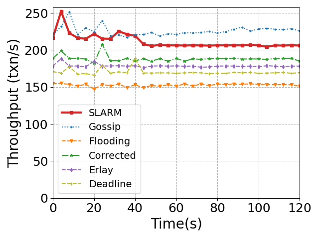

# Table of Contents
- [Q&A](#qa)
- [References](#references)
  * [New References](#new-references)
  * [References in Paper](#references-in-paper)

# Q&A

<!-- **1 Why we didn't adopt a structured network, which can provide even lower
bandwidth consumption and convergence latency?**

> SLARM, as well as typical blockchain message multicast protocols, is
> unstructured. The routing decisions are made independently by every P2P node
> based on their local views. This form of data multicast protocol is
> reliable, but not the most efficient, as it results in redundant transmissions
> and may lead to a large number of message collisions. 
>
> This is not the case with structured multicast protocols. For instance, a
> structured protocol can organize P2P nodes into a tree topology, and transmit
> messages over the tree structure (parent send to children). Structured
> disseminate protocols can reduce redundant transmissions and achieve lower
> bandwidth consumption in normal cases, but, on the other hand, they are very
> fragile (e.g., partition) in the presence of failures, lacking the natural
> resilience of unstructured protocols. 
> 
> A blockchain network is consist of heterogeneous nodes with diverse network
> conditions. Nodes can leave or join the network without asking for permission.
> Some critical applications such as trading are embedded with blockchain,
> making blockchain susceptible to various attacks. Therefore, the network
> topology of SLARM is still unstructured. -->

**1 Why did we limit each blockchain node's available bandwidth?**

> We limited the available bandwidth of each node for two reasons. First, in a
> Internet-wide blockchain system, nodes are deployed across several ISPs. The
> ISPs' maximum available bandwidth differs by area and connection type. For
> example, Comcast may offer connection speeds up to 50Mbps in some areas,
> whereas DSL services may offer a 20Mbps connection speed in another [new 2].
> To simulate commodity network links, we capped the bandwidth for each blockchain
> node to 20-30 Mbps, which is the same as Algorand [new 3]. Second, only
> increasing the nodes' bandwidth cannot significantly improve the SLA
> satisfaction rate. As shown in **Figure 2** below, we increase the bandwidth
> of all nodes to 100Mbps, the Ethereum-clique blockchain with five baseline P2P
> multicast protocols can achieve more stable throughputs under transaction
> spikes. However, their SLA satisfaction rates are still low. 

**2 Can existing transaction multicast protocols achieve higher SLA satisfaction
rates and throughputs with large network bandwidth?**

    
    
     
    
 Figure 2: SLA guarantee for SLA transactions and throughput for all transactions. (100Mbps bandwidth, 5000 nodes).  

> **Figure 2:** SLA guarantees for SLA transactions and throughputs for all
>transactions of the online trading application. 
>
> **New setting:** 100Mbps bandwidth, 5000 nodes.
> 
>**Experiment (same with paper):** At 0s, SLA (70%, all invoke smart contracts)
>and non-SLA (30%) >transactions are submitted to the network until peak
>throughput; at 48s, a >spike of 200 txn/s SLA transactions lasts for 5s. 
> 
>**Explanation:** With higher node bandwidth, the throughputs of all protocols
>are more stable under transaction spikes. However, the SLA satisfaction rates
>of existing P2P multicast protocols are still lower than SLARM. This is because
>existing protocols disseminate transactions in a FIFO manner, unaware of the
>priorities of transactions. Many non-SLA transactions are proposed before SLA
>transactions, SLA-stringent transactions are deferred by other transactions.

<!-- 3 For enforcing in-order execution for SLA transactions, why not clients submit
the next SLA transaction after all previous transactions have been committed? 

> Transactions will be committed to different blocks, which may incur too much
> latency to confirm all transactions.  -->

<!-- 4. How about only use transactions' timestamp rather than remaining deadline during multicast? -->

# References
[new 1] A Cost Analysis of Internet of Things Sensor Data Storage on Blockchain via Smart Contracts, Electronics '20.  
[new 2] https://tinyurl.com/yd8fsfb6  
[new 3] Algorand: Scaling Byzantine Agreements for Cryptocurrencies, SOSP '17.
